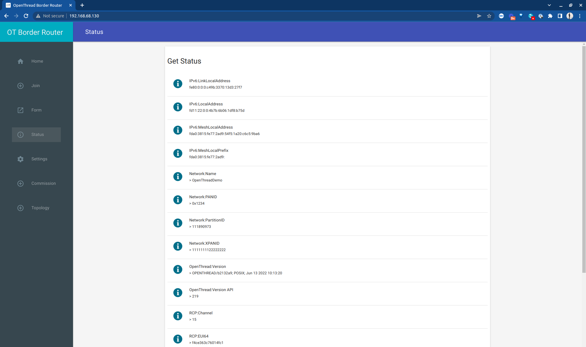
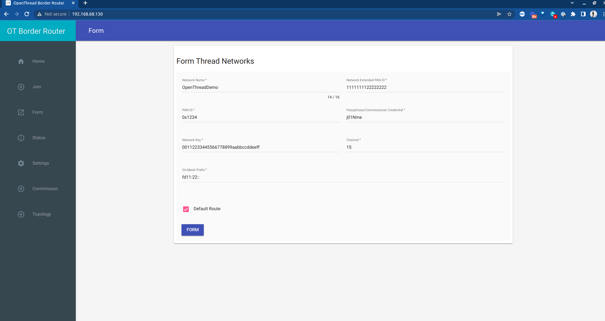

# Create an OpenThread Border Router

The OpenThread Border Router (OTBR) is a solution to get your packets from your Thread device out to the wider internet. It handles processing all of the incoming 802.15.4 traffic by utilizing the Radio Co-processor (RCP) as a modem and then forwarding packets along. It does the same in the other direction when an inbound packet is being directed towards an IPv6 based Thread device. The OTBR should be completely invisible to Thread Devices, much like a WiFi router is in a home or corporate network. 

## Step 1: Gather supplies

* Raspberry Pi
  * You will need a Raspberry Pi to be able to utilize the RCP via a USB port and then process all packets. 
  * We have tested this on the Raspberry Pi 3 and 4. Additional steps are required if using the smaller RPi Zero 2W.
  * We recommend you also have a monitor, HDMI cable, and USB Mouse/Keyboard available.
* MicroSD Card 
  * 8 GB Minimum
* RCP 
  * [See the previous page](create-rcp) for creating an RCP on an nRF52840 Dongle
* Network connection
  * We have tested the internet connection for the Raspberry Pi through WiFi and Ethernet, both should be a seamless connection. 

## Step 2: Raspberry Pi Initial Setup

The directions below were derived from [the Codelabs OpenThread directions for the Raspberry Pi](https://openthread.io/guides/border-router/raspberry-pi). We are replicating them here to reduce the directions down to the absolutely necessary steps to replicate our setup. 

We recommend using [the "Raspberry Pi OS with desktop" downloaded from the official repo page](https://www.raspberrypi.com/software/operating-systems/), as it allows you to showcase the OTBR web interface directly from your Raspberry Pi. We do this on [the Golioth Red Demo at conferences](https://blog.golioth.io/golioth-showcase-at-zds/) with a built-in screen. It is very useful to be able to directly navigate to the web browser on a monitor and commission the network. We also recommend you have a mouse and keyboard attached during install, as this is how the Raspberry Pi was designed to be commissioned. 

Burn the downloaded image to an SD card on your computer: 

* [Linux](https://www.raspberrypi.org/documentation/installation/installing-images/linux.md)
* [Mac OS](https://www.raspberrypi.org/documentation/installation/installing-images/mac.md)
* [Windows](https://www.raspberrypi.org/documentation/installation/installing-images/windows.md)

We recommend plugging an HDMI cable and USB Keyboard/mouse into your computer during first boot. 

## Step 3: Installing Daemon

From a terminal on your Raspberry Pi, clone the OTBR repository and run the install script:

```
git clone https://github.com/openthread/ot-br-posix
cd ot-br-posix
./script/bootstrap
```

This will download dependencies in Linux.

Next, choose if you want to install the `otbr-agent` using Ethernet or Wi-Fi (only choose one).

```
INFRA_IF_NAME=eth0 ./script/setup       # Ethernet
INFRA_IF_NAME=wlan0 ./script/setup      # Wi-Fi
```

The script will install all of the elements to the RPi.

## Step 4: Plug in the RCP

Check the settings on the `otbr-agent`

```
cat /etc/default/otbr-agent
```

We expect your RCP dongle to be at `/dev/ttyACM0`. If the output from the above command doesn't show that address, [follow the directions on the OpenThread page](https://openthread.io/guides/border-router/build#attach-and-configure-rcp-device)

## Step 5: Configure IPv6 to IPv4 translation

A critical step for most OTBR setups is to translate between IPv6 addresses and IPv4 addresses. Unless your RPi is commissioned with an IPv6 address on your home or work network (not common), you will need to complete this step. 

The service that does the NAT64 translation is called `tayga`. Try installing this on your machine, if you already have it installed, running this command will not be a problem:

```
sudo apt install tayga
```

Once you have tayga avilable on your computer, you need to ensure it is configured to properly route packets. 

Change (or confirm) the following settings in the tayga config file `/etc/tayga.conf`

```
tun-device nat64
ipv4-addr 192.168.255.1
ipv6-addr fdaa:bb:1::1
prefix 64:ff9b::/96
dynamic-pool 192.168.255.0/24
data-dir /var/spool/tayga
```

Test that `tayga` is running 

```
sudo service tayga status
```


You should see a screen that shows the service listed as `active`. Type `q` to escape the status screen at any time. If the service is now showing as activenotnot, start (or restart) the service using the command 

```
sudo service tayga start
```

Finally, we want to add a route to `tayga` so that it knows how to route packets out to the internet. 

```
sudo ot-ctl route add 64:ff9b::/96 s med
sudo ot-ctl netdata register
```

## Step 6: Testing OTBR

Now that you have your OTBR set up, you'll want to test it.

First, see if you can ping a Google DNS server (8.8.8.8) on its IPv6 address:

```
ping 64:ff9b::808:808
```

You should see responses, even though you're not pinging from the Thread node. This shows that the IPv6 -> IPv4 routing is working.

Next, make sure your `otbr-agent` and `otbr-web` are up and running. The agent does the handling of incoming traffic on the Thread network on the RCP, as well as moving packets through to the internet. 

```
sudo service otbr-agent status
```

The `otbr-web` hosts a webpage on port 80, which makes it much simpler to set up and troubleshoot your network.

```
sudo service otbr-web status
```

You should see a page at https://localhost if logged in to the Raspberry Pi. If you're accessing the RPi via SSH, you can access the page at the device's IP address, like http://192.168.1.2 (check your router to see what the address was assigned to the RPi)



On the page above, I navigated to the "Status" tab on the left side menu, which shows teh following troubleshooting information. You should also be able to access this using various commands options in the `ot-ctl` command.

## Step 7: Forming a Thread Network

Click on the "Form" tab on the left side of the web interface (3rd option). 



The Network Name and Network Key operate much like a WiFi SSID and password. These will be used later, so note them down if you use something different from the default (recommended).

Click the blue "FORM" button and verify that you want to form a network.