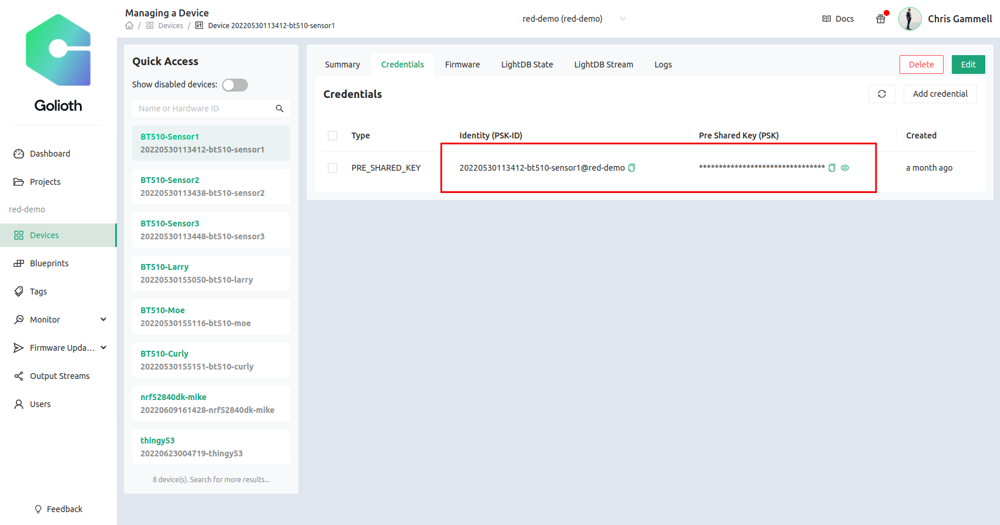

# Create a node on your Thread Network

Now that we have set up an OTBR in the previous step, we want to build a Node that will begin communicating to the wider internet using the OTBR. The node will be built using Zephyr and will have the OpenThread stack compiled into it. Golioth has a starter project on GitHub that will be used throughout this section of the tutorial. This has all of the Golioth required elements to get a Node connected to the Golioth Cloud and transmitting data back and forth. This code also includes a shell to interact directly with your device and program in credentials for both connecting to your OTBR and validating onto the Golioth netwwork.

## Step 1: Obtain supplies

* **Option 1** (Preferred)
  * [BT510 from Laird](https://www.lairdconnect.com/iot-devices/iot-sensors/bt510-bluetooth-5-long-range-ip67-multi-sensor)
  * [Laird SWD USB programming kit](https://www.lairdconnect.com/wireless-modules/programming-kits/usb-swd-programming-kit)
* **Option 2**
  * nRF52840-DK

### Comparing options

For **Option 1**, we chose a board that is already in a case and could easily be deployed in the field. It is IP67, which means it will stand up to the elements. It also has sensors onboard:
* Temperature
* Accelerometer
* Magnetic detection

There are also interactive elements on this board, including:

* A push button that can be accessed from outside the package
* A bi-color user LED

The downside to the BT510 is that the board only has the chip on-board, so it requires an additional programmer in order to interact with the chip. There is a serial port interface built into this programmer as well.

In **Option 2**, the programmer and debugger are built into the nRF52840-DK, so no external one is required (lower cost, lower complexity). However, the nRF52840-DK does not have any sensors onboard, so we will only be able to send data like the core temperature of the silicon chip. Adding external sensors is outside the scope of this tutorial, but is definitely possible later.

## Step 2: Get device credentials

If you have not yet done so, go through the [Golioth Getting Started Guide](https://docs.golioth.io/getting-started), in order to get credentials on the Golioth Cloud.

Grab credentials from [the "devices" tab on the Golioth Console](https://console.golioth.io/devices). The Pre-Shared Key Identification (PSK ID) and Pre-Shared Key (PSK) are similar to a username/password combination. Your node device will need these credentials to validate onto the Golioth network. We will program them in via the serial terminal once the device is programmed.



## Step 3: Install dependencies (first time Zephyr users)

If this is your first time working with Zephyr, you will need to install the Zephyr support tools in order to build the firmware for the node device. If you have used Zephyr before, you almost certainly have all of these dependencies statisfied on your system and you can skip to Step 4.

### Linux System Dependencies

We are showing how to build in Linux, which is the preferred method. The tools below will ensure you have Python set up properly and are able to access other tools like `wget`.

```
sudo apt update
sudo apt install --no-install-recommends git cmake ninja-build gperf \
  ccache dfu-util device-tree-compiler wget \
  python3-dev python3-pip python3-setuptools python3-tk python3-wheel xz-utils file \
  make gcc gcc-multilib g++-multilib libsdl2-dev
```

### Zephyr Compilers

If this is the first time you are using Zephyr, you will also need the compiler for building the code (`gcc`, for example). This is known as the Zephyr SDK Toolchain, which is a bit confusing, but is ultimately a bunch of compilers bundled together. Once you have these in your system, you will be able to build firmware for any of the supported Zephyr boards, not just nRF52840.

```
cd ~
wget https://github.com/zephyrproject-rtos/sdk-ng/releases/download/v0.15.1/zephyr-sdk-0.15.1_linux-x86_64.tar.gz
```

Unpack the archive and run the installer. The SDK will be placed in the ~/zephyr-sdk-0.14.2 directory:
```
tar -xvf zephyr-sdk-0.14.2_linux-x86_64.tar.gz
cd zephyr-sdk-0.14.2
./setup.sh
```
Answer y to both of the questions asked during the setup process.

Install udev rules, which allow you to flash most Zephyr boards as a regular user:
```
sudo cp ~/zephyr-sdk-0.14.2/sysroots/x86_64-pokysdk-linux/usr/share/openocd/contrib/60-openocd.rules /etc/udev/rules.d/
sudo udevadm control --reload
```

## Step 4: Download the repo

Now that dependencies are installed, we are ready to compile the node firmware using Zephyr, Golioth, and OpenThread.

The repository we're using is called a "standalone repository" from the Golioth OpenThread Demo. This not only has the source code that you will be able to change, but it also calls out the dependencies in order to build all of the underlying tooling, such as the OpenThread stack. We will be using Nordic Semiconductor's Nordic Connect SDK (NCS) as part of the setup. This will allow us to build the firmware for the nRF52840, the chip inside the BT510.

First, we'll create a virtual environment for our system
```
python3 -m venv ~/golioth-openthread/.venv
source ~/golioth-openthread/.venv/bin/activate
pip install west
```

Then we clone the Golioth OpenThread repository (including `app/west.yml` which lists all the dependencies and which versions to go fetch)

```
west init -m https://github.com/golioth/golioth-openthread-demo.git ~/golioth-openthread
cd golioth-openthread
```

Finally, we tell `west` (the meta tool build system) to go and fetch all of the dependencies, including specific versions of NCS. After the update, we'll tell the system where to find everything.

```
west update
west zephyr-export
pip install -r ~/golioth-openthread/deps/zephyr/scripts/requirements.txt
```

## Step 5: Compile and flash the code

OK, phew, we made it! (didn't make it? [Let us know on our forum](https://forum.golioth.io) for more help)

Now we're finally ready to build the firmware. The nice thing is that the BT510 device that we're targeting already is a supported board in Zephyr. The command to build for that board is simply:

```
west build -b bt510 app
west flash
```

The flash step requires that you have the SWD USB Programmer pluged into your computer and the board.

## Step 6: Add device to Thread network

The OpenThread shell gives you the ability to configure and query the state of the Thread network you are connecting to. Many of the commands available on the command line (shell) are also available as settings in `menuconfig` and can be set via project settings (`prj.conf`) or in board settings (`<boardname>.conf`) inside the boards folder. We are going to set these manually because learning is important. You will set the credentials of your device using the same credentials you set on the OTBR. There are default OTBR credentials that we will be using below, but be sure to check the credentials on your particular OTBR.

Connect to your device over UART. The Laird USB SWD programmer has a UART built in. On linux machines this may look like `/dev/ttyUSB0`. Once you have connected, use the `ot` command to query and set configurations in the OpenThread stack.

```
uart:~$ ot ifconfig down
uart:~$ ot dataset networkkey 00112233445566778899aabbccddeeff
uart:~$ ot dataset networkname OpenThreadDemo
uart:~$ ot dataset commit active
uart:~$ ot ifconfig up
uart:~$ ot thread start
```

This should give us the credentials to get the BT510 onto the local Thread network created by the OTBR. Run the following command to check status.

```
uart:~$ ot state
```

You should see it report as `child` or `router`. You can also check the "Topology" tab on the OTBR to see if a device has joined the network (should be two dots connected by a line instead of one dot by itself)

After the node has successfully connected to the Thread network, it has access to the internet! You should be able to ping Google DNS servers from the node, just like you did from the OTBR:

```
uart:~$ ot ping 64:ff9b::808:808
```

## Step 7: Add Golioth credentials

Now that we can talk to the internet, let's get this thing hooked to Golioth. Doing so will give us a convenient way to collect data, send commands back to devices, and update firmware. We will be using the [Settings Shell](https://blog.golioth.io/new-feature-updating-zephyr-settings-from-the-device-shell-and-more/), which is already compiled into the code.

Once again we will connect to the UART on the device (you may still be connected) and assign your credentials gained in Step 2:

```
uart:~$ settings set golioth/psk-id <my-psk-id@my-project>
uart:~$ settings set golioth/psk <my-psk>
uart:~$ kernel reboot cold
```

The final command is the kernel shell, where we can send a reset command over the UART. Once a reboot happens, we should see that the device once again connects to the Thread network, and can now reach out to Golioth servers and start sending data. The settings are saved into a special area of flash that will persist between reboots.