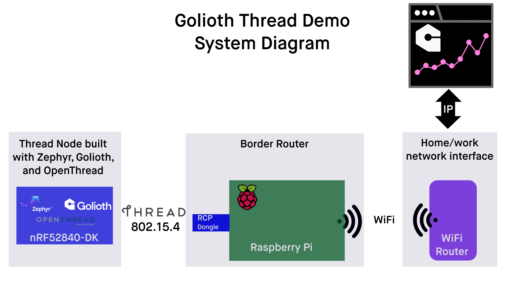

# Golioth Thread Demo Overview

## What is this Demo all about?

This is a place where you're going to learn about Golioth features and how to create Thread networks by playing with hardware. 

### System diagram

## How can you use this material after training is over?

Developers who successfully complete this training should feel confident that they will be able to program and deploy a simple Threaad based IoT system to the field in their application.

## What is Zephyr RTOS? Why are we learning it?

[Zephyr](https://zephyrproject.org/) is an open source Real Time Operating System (RTOS) with wide support among industry leading chip vendors. At Golioth, we build [the Golioth SDK](https://github.com/golioth/zephyr-sdk/) on top of the Zephyr SDK in order to take advantage of the wide hardware support. What's amazing about the project is that you can switch between different hardware platforms with a command line switch and a file that tells the application which pins are assigned to which function.

Golioth lives at the top of the Zephyr stack, meaning that we take advantage of all of the networking capabilities built into Zephyr. When Golioth needs to talk to the internet, it simply communicates with the networking layer's APIs. From this perspective, we can switch between Cellular, WiFi, Thread, and Ethernet implementations easily. In the future, we hope to also tap into more "hub and spoke" model devices such as LoRa and Bluetooth as well. The main thing for you to know, as the Developer, is that you have maximum flexibility when trying out or deploying new systems.
