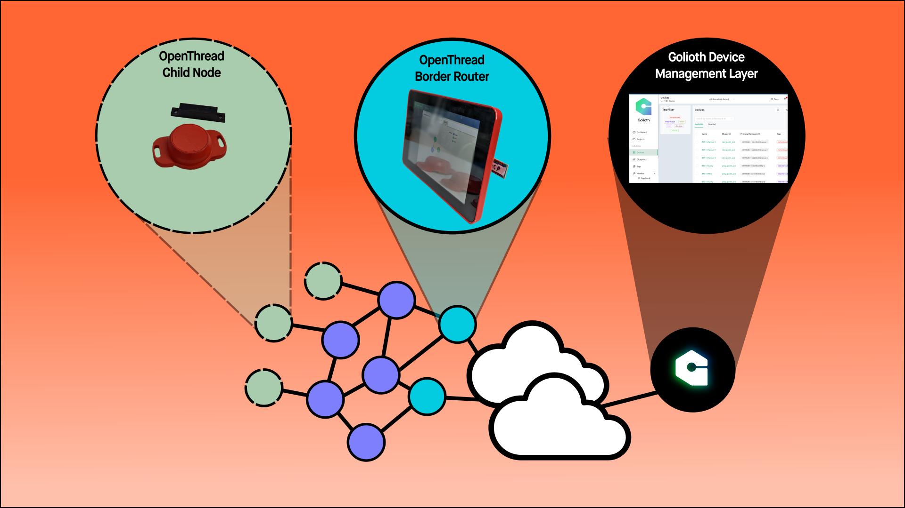

# Golioth Thread Demo Overview

## What is this Demo all about?

This is a place where you're going to learn about Golioth features and how to create a network of Thread devices by playing with hardware. 

### System diagram

## What is Thread?

Thread (and the OpenThread implementation we are using here) is a networking protocol built on top of 802.15.4. It handles the network setup and meshing of small devices using 2.4 GHz radios. Once the network is set up, each device on the mesh network will have it's own IPv6 address and be speaking using CoAP (a transport layer) over UDP. 

### High Level Video overview

[Smart Home Protocols](https://www.youtube.com/channel/UCrVLgIniVg6jW38uVqDRIiQ) made this video showcasing how Thread works, especially in a consumer setting

<iframe width="560" height="315" src="https://www.youtube.com/embed/0JC4tNe0OS4" title="YouTube video player" frameborder="0" allow="accelerometer; autoplay; clipboard-write; encrypted-media; gyroscope; picture-in-picture" allowfullscreen></iframe>

## Why Golioth is a great fit for Thread applications

Golioth develops and hosts CoAP-based API endpoints on the web, which are built to receive UDP packets. As such, we can talk directly to the IPv6 addressed devices, and use the Golioth console as a management platform for Thread based devices! Any of the services that Golioth users know and love can be implemented on Thread based devices:

* Logging
* LightDB State
* LightDB Stream
* DFU

We will showcase many of these functions in the [Thread Node section](create-thread-node) of these docs.

## How can you use this material after training is over?

Developers who successfully complete this training should feel confident that they will be able to program and deploy a simple Thread based IoT system to the field in their application.